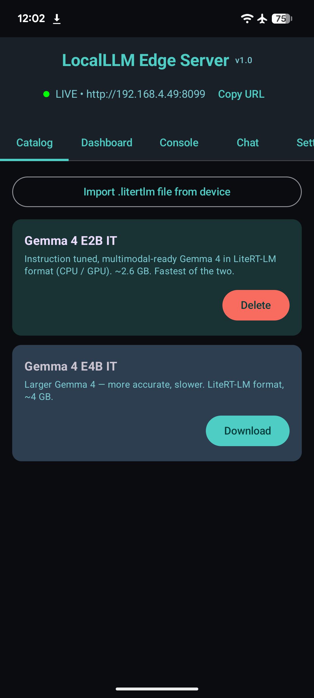
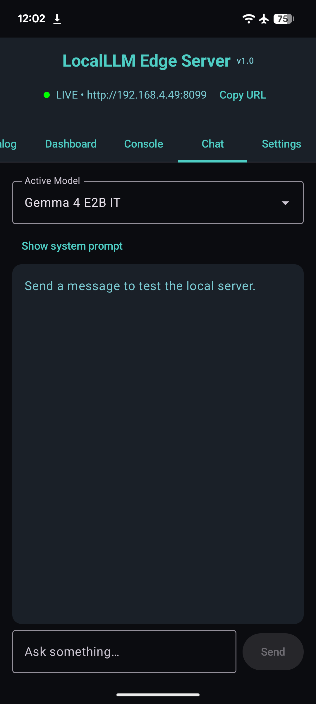
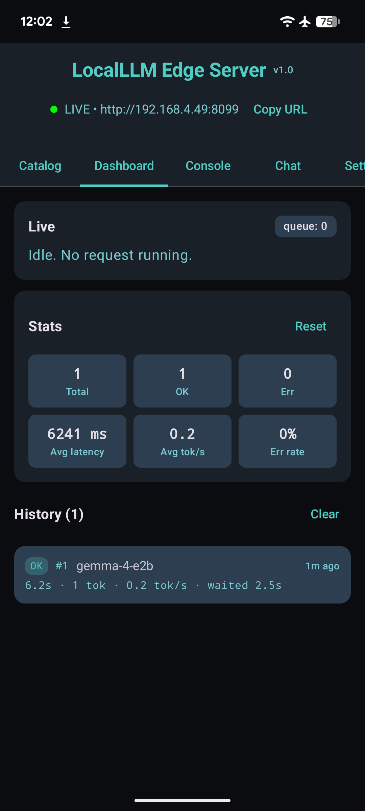
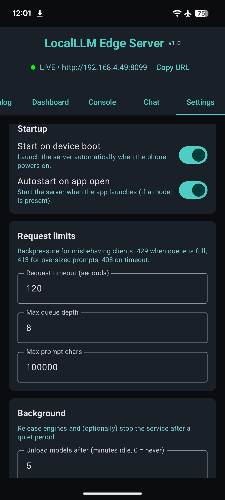

# LocalLLM Edge Server

**An on-device, OpenAI-compatible LLM HTTP server for Android.** Runs
[Gemma 4](https://huggingface.co/litert-community) locally on the phone
via Google's LiteRT-LM runtime, exposes the OpenAI Chat Completions API
on a configurable port — no cloud, no remote API key, no data leaves
the device.

<div class="grid cards" markdown>

-   :material-rocket-launch:{ .lg .middle } __Open-API drop-in__

    ---

    Any OpenAI client library can talk to it. Streaming SSE,
    `session_id`-based KV cache reuse, per-request `temperature` /
    `top_k` / `max_tokens` — all wire-compatible with
    `POST /v1/chat/completions`.

    [:octicons-arrow-right-24: HTTP API](api.md)

-   :material-cpu-64-bit:{ .lg .middle } __LiteRT-LM, not MediaPipe__

    ---

    Loads `.litertlm` bundles via
    `com.google.ai.edge.litertlm:litertlm-android:0.11.0` — Google's
    successor runtime to MediaPipe `tasks-genai`. AUTO backend tries
    GPU first, falls back to CPU if the OpenCL/OpenGL delegate can't
    initialize on the device.

    [:octicons-arrow-right-24: Architecture](architecture.md)

-   :material-android:{ .lg .middle } __Production-leaning Android app__

    ---

    Foreground service with `specialUse` declaration, SHA-256 download
    verification, signed-bearer-token API key, partial wake-lock under
    inference, idle-eviction of GB-sized engines, atomic queue cap with
    `429 Retry-After`, SSE error chunks (no silent drops).

    [:octicons-arrow-right-24: Getting started](getting-started.md)

-   :material-code-tags:{ .lg .middle } __Hackable__

    ---

    ~2k lines of Kotlin + Compose on top of Ktor 3. Single Gradle
    module, single test target, CI gating with GitHub Actions. New
    catalog entries are one struct + a SHA-256.

    [:octicons-arrow-right-24: Development](development.md)

</div>

## What it looks like

<div class="grid" markdown>

{ width=250 }
{ width=250 }
{ width=250 }
{ width=250 }

</div>

## Quick demo

```bash
# 1. Install
adb install -r app-debug.apk

# 2. Open the app, tap "Download" on Gemma 4 E2B IT (~2.6 GB)
#    The server autostarts once a model is on disk.

# 3. Forward the port to your laptop (or use the LAN IP from the app header)
adb forward tcp:8099 tcp:8099

# 4. Send a request — exactly the same shape as OpenAI's API
curl http://localhost:8099/v1/chat/completions \
  -H "Content-Type: application/json" \
  -d '{
    "model": "gemma-4-e2b",
    "messages": [{"role": "user", "content": "Say hi in one word."}]
  }'
# → {"choices":[{"finish_reason":"stop","index":0,"message":{"content":"Hi.","role":"assistant"}}],...}
```

## Why this exists

The MediaPipe `tasks-genai` Android library doesn't ship Gemma 4 support
— Google split on-device delivery onto LiteRT-LM. This app is the
glue: takes any `.litertlm` bundle from
[`litert-community`](https://huggingface.co/litert-community), wraps it
in the public LiteRT-LM runtime, and exposes it as a local HTTP server
so every app on the device (or every device on your LAN) can use the
same model without each one shipping a 2.6 GB binary.

It's the same idea as running [Ollama](https://ollama.ai) on a laptop,
except the daemon runs in your pocket.

## License

[Apache 2.0](https://github.com/mlnomadpy/localllm/blob/main/LICENSE).
The Gemma model weights themselves are governed by [Google's Gemma
Terms of Use](https://ai.google.dev/gemma/terms).
